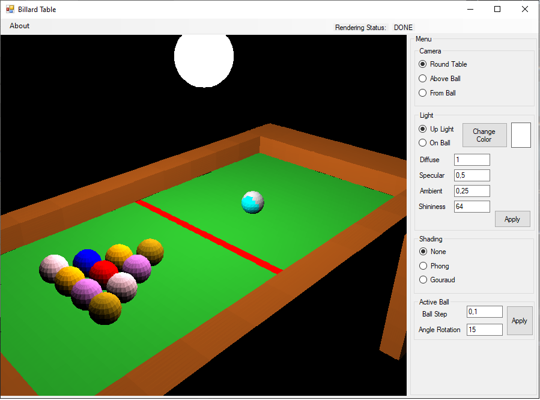

# Billard3D
_Application created as a part of the **Computer graphics 1** course, at the **MINI PW** faculty._

Application was developed in the C# programming language (in WinForms) without using any graphical API to render 3D models.
Rendering proces was built from scratch.

Application contains:
* Z-Buffor implementation
* Gourand and Phong shading algorithm implementation
* Phong illumination model implementation
* Rendering pipeline implementation

*Billard 3D graphical user interface*

More information about how to use 3DBillard application [[Billard3D Instruction](instruction.md)]

